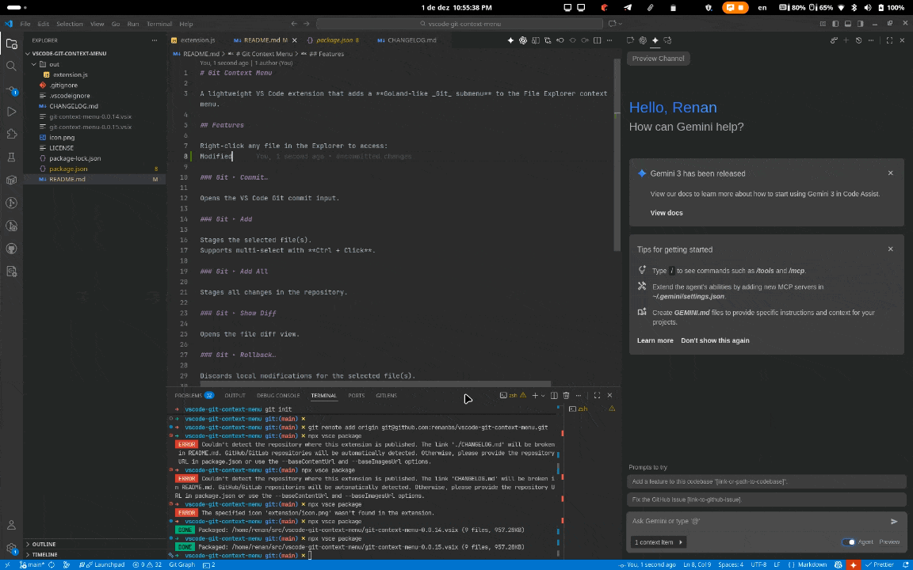

# Git Context Menu

A lightweight VS Code extension that adds a **GoLand-like _Git_ submenu** to the File Explorer context menu.

## Features

Right-click any file in the Explorer to access:
Modified

### Git ▸ Commit…

Opens the VS Code Git commit input.

### Git ▸ Add

Stages the selected file(s).
Supports multi-select with **Ctrl + Click**.

### Git ▸ Add All

Stages all changes in the repository.

### Git ▸ Show Diff

Opens the file diff view.

### Git ▸ Rollback…

Discards local modifications for the selected file(s).

### Git ▸ New Branch…

Opens the “Create Branch” dialog.

### Git ▸ Push… / Pull…

Runs the standard push/pull operations.

All entries use VS Code codicons for a clean, JetBrains-style look.

## Requirements

- VS Code **1.85.0+**
- Git installed and available in PATH
- Built-in Git extension enabled
- An open folder that is a valid Git repository

## Changelog

See [CHANGELOG.md](CHANGELOG.md).
